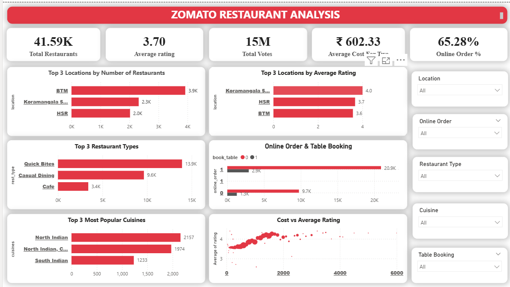
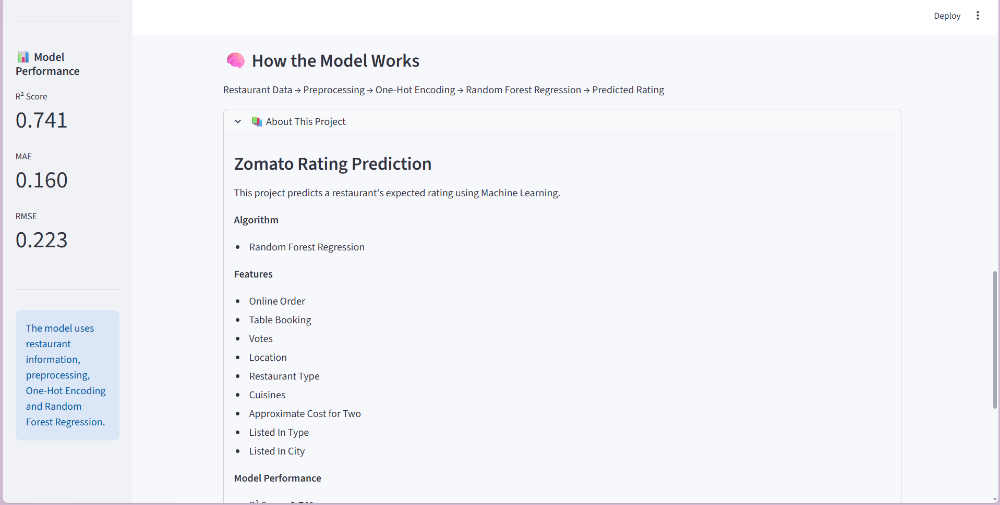
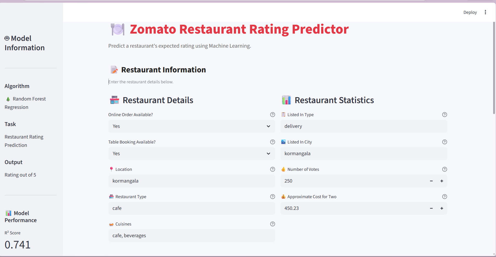
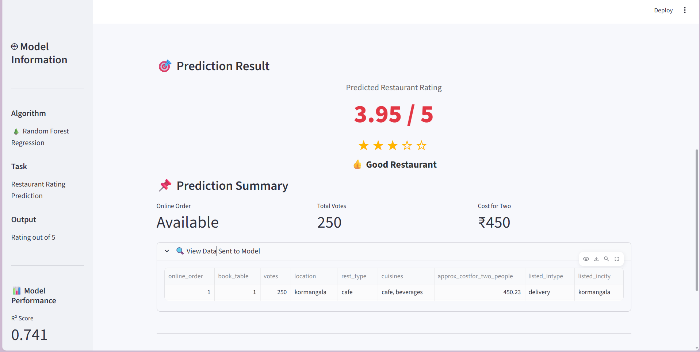

# 🍽️ Zomato Restaurant Analytics & Rating Prediction

An end-to-end **Data Analytics and Machine Learning project** that analyzes restaurant data, identifies key factors influencing restaurant ratings, and predicts restaurant ratings using a tuned **Random Forest Regression model**.

The project combines **Python, Exploratory Data Analysis, Machine Learning, Power BI, and Streamlit** to demonstrate a complete data science workflow from raw data to an interactive deployed application.

---

## 📌 Project Overview

Restaurant platforms contain large amounts of information related to cuisines, pricing, locations, customer preferences, online ordering, table booking, and ratings.

The objective of this project is to analyze these factors and build a machine learning model capable of predicting restaurant ratings.

The complete workflow includes:

* Data Cleaning & Preprocessing
* Exploratory Data Analysis (EDA)
* Feature Engineering
* Power BI Dashboard
* Machine Learning Model Development
* Hyperparameter Tuning
* Model Evaluation
* Streamlit Web Application
* Cloud Deployment

---

## 🎯 Project Objectives

The main objectives of this project are:

* Analyze restaurant trends and customer preferences
* Identify important factors affecting restaurant ratings
* Explore relationships between price, location, services, cuisines, and ratings
* Build an accurate restaurant rating prediction model
* Create an interactive Power BI dashboard
* Develop a user-friendly prediction application
* Deploy the final machine learning solution using Streamlit Cloud

---

## 🛠️ Tech Stack

### Programming & Data Analysis

* Python
* Pandas
* NumPy

### Data Visualization

* Matplotlib
* Seaborn
* Power BI

### Machine Learning

* Scikit-learn
* Random Forest Regressor
* Hyperparameter Tuning

### Deployment

* Streamlit
* Streamlit Community Cloud

### Development Tools

* Jupyter Notebook
* VS Code
* Git
* GitHub

---

## 📊 Exploratory Data Analysis

The dataset was cleaned and analyzed to understand restaurant characteristics and rating patterns.

Key areas explored include:

* Restaurant rating distribution
* Online ordering availability
* Table booking availability
* Cost distribution
* Location-wise restaurant performance
* Cuisine patterns
* Relationship between restaurant features and ratings

The EDA helped identify meaningful patterns and provided the foundation for feature engineering and model development.

---

## 📈 Power BI Dashboard

The interactive Power BI dashboard provides insights into restaurant ratings, locations, cuisines, pricing, and customer preferences.



The dashboard helps analyze:

* Overall restaurant performance
* Rating distribution
* Location-wise trends
* Online ordering behavior
* Table booking trends
* Cost patterns
* Cuisine-level insights

### Dashboard Preview

> Add the final Power BI dashboard screenshot here.

```text
screenshots/powerbi_dashboard.png
```

---

## 🤖 Machine Learning Model

Multiple stages of model development were performed before selecting the final model.

The final prediction system uses a **Random Forest Regressor** with optimized hyperparameters.

### Final Model Performance

| Metric   |      Score |
| -------- | ---------: |
| MAE      | **0.1603** |
| RMSE     | **0.2233** |
| R² Score | **0.7409** |

### Interpretation

* **MAE = 0.1603** means the model's predictions differ from actual ratings by approximately 0.16 rating points on average.
* **RMSE = 0.2233** indicates relatively low overall prediction error.
* **R² = 0.7409** means the model explains approximately **74.09% of the variation** in restaurant ratings on the evaluation data.

---

### 🤖 Model Workflow

The final prediction pipeline includes data preprocessing, feature engineering, Random Forest model training, hyperparameter tuning, evaluation, and deployment.



---

## ⚙️ Machine Learning Workflow

```text
Raw Dataset
     ↓
Data Cleaning
     ↓
Exploratory Data Analysis
     ↓
Feature Engineering
     ↓
Train-Test Split
     ↓
Random Forest Regression
     ↓
Hyperparameter Tuning
     ↓
Model Evaluation
     ↓
Model Serialization
     ↓
Streamlit Application
     ↓
Cloud Deployment
```

---

## 🌐 Streamlit Prediction App

The deployed Streamlit application allows users to enter restaurant details and receive a predicted restaurant rating.



### 🎯 Prediction Result



### Application Features

* Simple interactive UI
* Restaurant feature input
* Real-time rating prediction
* Pre-trained Random Forest model
* Input validation
* Cloud-based deployment

### App Preview.

> Add the final Streamlit application screenshot here.

```text
screenshots/streamlit_app.png
```

---

## 📁 Recommended Repository Structure

```text
ZOMATO_RATING_PREDICTION/
│
├── app.py
├── requirements.txt
├── README.md
│
├── data/
│   └── zomato.csv
│
├── notebooks/
│   └── zomato_analysis.ipynb
│
├── model/
│   └── rating_model.pkl
│
├── dashboard/
│   └── zomato_dashboard.pbix
│
└── screenshots/
    ├── powerbi_dashboard.png
    └── streamlit_app.png
```

---

## 🚀 Run the Project Locally

### 1. Clone the Repository

```bash
git clone https://github.com/Ganu180/ZOMATO_RATING_PREDICTION.git
```

### 2. Open the Project

```bash
cd ZOMATO_RATING_PREDICTION
```

### 3. Install Dependencies

```bash
pip install -r requirements.txt
```

### 4. Run the Streamlit Application

```bash
streamlit run app.py
```

The application will start locally in your browser.

---

## 💡 Key Learnings

Through this project, I gained hands-on experience in:

* Cleaning and preprocessing real-world datasets
* Performing exploratory data analysis
* Creating business dashboards using Power BI
* Feature engineering for machine learning
* Training regression models
* Hyperparameter tuning
* Evaluating models using MAE, RMSE, and R²
* Building interactive ML applications with Streamlit
* Managing large machine learning model files
* Using Git and GitHub for version control
* Deploying machine learning applications to the cloud

---

## 🔮 Future Improvements

Potential improvements include:

* Compare additional regression algorithms
* Implement advanced feature engineering
* Add model explainability using SHAP
* Improve application UI/UX
* Add additional restaurant analytics
* Automate model retraining
* Build an API for prediction
* Deploy using containerized infrastructure

---

## 👨‍💻 Author

**Ganesh Gokhale**

Data Science & Data Analytics | Python | Machine Learning | Power BI

GitHub: `Ganu180`

---

## ⭐ Support

If you found this project useful or interesting, consider giving the repository a ⭐.
